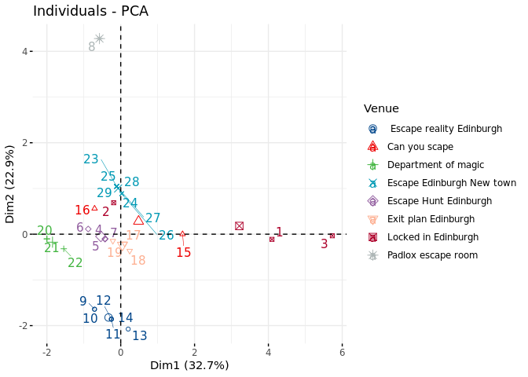

# Parsing the metadata 

The metadat was collected from escape rooms reviews on TripAdvisor as following:

 - Venues with more than 100, 5 Star reviews were filtered
 - Details of the game (min/max players) and difficulty/interesting scored was collected
 - Restuarants, bars and pubs within 15 min walking distance of the Venues were filtered for min 4.5 stars on google maps
 - Distance from work measured in miles via driving

# The dataframe


```r
erd<-read.csv(file = "/mnt/e/escape_room_edinburgh.csv",header = TRUE,stringsAsFactors = FALSE)
erd$Venue<-as.factor(erd$Venue)
erd$Game<-as.factor(erd$Game)
erd$URL<-paste0("<a href='",erd$URL,"'>",erd$URL,"</a>")
datatable(data = erd %>% arrange(desc(revs_tripadvisor)),
          escape = FALSE,
          style = "bootstrap",
          options = list( autoWidth = TRUE , 
                           pageLength = 10,
                           searchHighlight = TRUE,
                           scrollX = TRUE))
```

<!--html_preserve--><div id="htmlwidget-8b7a20d7663946084323" style="width:100%;height:auto;" class="datatables html-widget"></div>
<script type="application/json" data-for="htmlwidget-8b7a20d7663946084323">{"x":{"style":"bootstrap","filter":"none","data":[["1","2","3","4","5","6","7","8","9","10","11","12","13","14","15","16","17","18","19","20","21","22","23","24","25","26","27","28","29"],["Locked in Edinburgh","Locked in Edinburgh","Locked in Edinburgh","Can you scape","Can you scape","Escape Edinburgh New town","Escape Edinburgh New town","Escape Edinburgh New town","Escape Edinburgh New town","Escape Edinburgh New town","Escape Edinburgh New town","Escape Edinburgh New town","Exit plan Edinburgh","Exit plan Edinburgh","Exit plan Edinburgh"," Escape reality Edinburgh"," Escape reality Edinburgh"," Escape reality Edinburgh"," Escape reality Edinburgh"," Escape reality Edinburgh"," Escape reality Edinburgh","Padlox escape room","Department of magic","Department of magic","Department of magic","Escape Hunt Edinburgh","Escape Hunt Edinburgh","Escape Hunt Edinburgh","Escape Hunt Edinburgh"],["The cutting room ","The distillary","The secret lab","Operation spellbound","Operation Odyssey","The magic emporium","221B Baker street","The experiment","Area51","Houdinis workshop","Casino","Contagion","The tesla cube","Svengalis lair","Framed","JUNGALA","TORTUGA PIRATES","MACHINA","THE ASYLUM","ALCATRAZ","NOSFERATU","Going for gold","Prophecies quest","Dark lord resurrection","Magic potion Tavern","Escape the wild west","Blackbeards treasure","The forth samurai","The last vikings"],[3,2,4,2,2,2,2,2,2,2,2,2,2,2,2,2,2,2,2,2,2,2,2,2,2,2,2,2,2],[8,2,10,10,4,6,5,6,5,6,6,6,7,6,6,6,6,6,6,6,6,6,5,5,5,6,6,6,6],[5,3,4,5,4,3,4,3,4,3,3,3,3,4,3,3,3,4,4,5,4,4,3,3,4,4,4,3,4],[16,16,16,7,7,11,11,11,11,11,11,11,9,9,9,3,3,3,3,3,3,15,4,4,4,10,10,10,10],[2,2,2,13,13,12,12,12,12,12,12,12,5,5,5,4,4,4,4,4,4,14,14,14,14,10,10,10,10],[875,875,875,836,836,836,836,836,836,836,836,836,491,491,491,400,400,400,400,400,400,185,160,160,160,158,158,158,158],[6.7,6.7,6.7,7.2,7.2,7.1,7.1,7.1,7.1,7.1,7.1,7.1,7.3,7.3,7.3,6.2,6.2,6.2,6.2,6.2,6.2,13.9,7.1,7.1,7.1,6.9,6.9,6.9,6.9],["<a href='https://www.lockedinedinburgh.com/'>https://www.lockedinedinburgh.com/<\/a>","<a href='https://www.lockedinedinburgh.com/'>https://www.lockedinedinburgh.com/<\/a>","<a href='https://www.lockedinedinburgh.com/'>https://www.lockedinedinburgh.com/<\/a>","<a href='https://www.canyouescape.co.uk/edinburgh'>https://www.canyouescape.co.uk/edinburgh<\/a>","<a href='https://www.canyouescape.co.uk/edinburgh'>https://www.canyouescape.co.uk/edinburgh<\/a>","<a href='https://www.escapeteambuilding.co.uk/'>https://www.escapeteambuilding.co.uk/<\/a>","<a href='https://www.escapeteambuilding.co.uk/'>https://www.escapeteambuilding.co.uk/<\/a>","<a href='https://www.escapeteambuilding.co.uk/'>https://www.escapeteambuilding.co.uk/<\/a>","<a href='https://www.escapeteambuilding.co.uk/'>https://www.escapeteambuilding.co.uk/<\/a>","<a href='https://www.escapeteambuilding.co.uk/'>https://www.escapeteambuilding.co.uk/<\/a>","<a href='https://www.escapeteambuilding.co.uk/'>https://www.escapeteambuilding.co.uk/<\/a>","<a href='https://www.escapeteambuilding.co.uk/'>https://www.escapeteambuilding.co.uk/<\/a>","<a href='http://exitplanedinburgh.co.uk/'>http://exitplanedinburgh.co.uk/<\/a>","<a href='http://exitplanedinburgh.co.uk/'>http://exitplanedinburgh.co.uk/<\/a>","<a href='http://exitplanedinburgh.co.uk/'>http://exitplanedinburgh.co.uk/<\/a>","<a href='https://www.escapereality.com/escape-rooms-uk/edinburgh/'>https://www.escapereality.com/escape-rooms-uk/edinburgh/<\/a>","<a href='https://www.escapereality.com/escape-rooms-uk/edinburgh/'>https://www.escapereality.com/escape-rooms-uk/edinburgh/<\/a>","<a href='https://www.escapereality.com/escape-rooms-uk/edinburgh/'>https://www.escapereality.com/escape-rooms-uk/edinburgh/<\/a>","<a href='https://www.escapereality.com/escape-rooms-uk/edinburgh/'>https://www.escapereality.com/escape-rooms-uk/edinburgh/<\/a>","<a href='https://www.escapereality.com/escape-rooms-uk/edinburgh/'>https://www.escapereality.com/escape-rooms-uk/edinburgh/<\/a>","<a href='https://www.escapereality.com/escape-rooms-uk/edinburgh/'>https://www.escapereality.com/escape-rooms-uk/edinburgh/<\/a>","<a href='https://www.padlox.co.uk/'>https://www.padlox.co.uk/<\/a>","<a href='http://departmentofmysteries.com/'>http://departmentofmysteries.com/<\/a>","<a href='http://departmentofmysteries.com/'>http://departmentofmysteries.com/<\/a>","<a href='http://departmentofmysteries.com/'>http://departmentofmysteries.com/<\/a>","<a href='https://escapehunt.com/uk/edinburgh/'>https://escapehunt.com/uk/edinburgh/<\/a>","<a href='https://escapehunt.com/uk/edinburgh/'>https://escapehunt.com/uk/edinburgh/<\/a>","<a href='https://escapehunt.com/uk/edinburgh/'>https://escapehunt.com/uk/edinburgh/<\/a>","<a href='https://escapehunt.com/uk/edinburgh/'>https://escapehunt.com/uk/edinburgh/<\/a>"]],"container":"<table class=\"table table-striped table-hover\">\n  <thead>\n    <tr>\n      <th> <\/th>\n      <th>Venue<\/th>\n      <th>Game<\/th>\n      <th>min_player<\/th>\n      <th>max_player<\/th>\n      <th>difficulty_5<\/th>\n      <th>rest_walking<\/th>\n      <th>pubs_walking<\/th>\n      <th>revs_tripadvisor<\/th>\n      <th>distance_work<\/th>\n      <th>URL<\/th>\n    <\/tr>\n  <\/thead>\n<\/table>","options":{"autoWidth":true,"pageLength":10,"searchHighlight":true,"scrollX":true,"columnDefs":[{"className":"dt-right","targets":[3,4,5,6,7,8,9]},{"orderable":false,"targets":0}],"order":[],"orderClasses":false}},"evals":[],"jsHooks":[]}</script><!--/html_preserve-->

# Priciple component analysis:


```r
#PCA prep
erd_scaled<-scale(x = erd[-c(1:2,10)],center = TRUE,scale = TRUE)
erd_ready<-cbind.data.frame(erd[1:2],erd_scaled)
erd_pca<-PCA(X = erd_ready,ncp = 3,quali.sup = c(1,2), graph = FALSE)
fviz_pca(erd_pca)
```


```r
fviz_pca_ind(erd_pca,habillage = "Venue",repel = TRUE,palette = "lancet")
```


